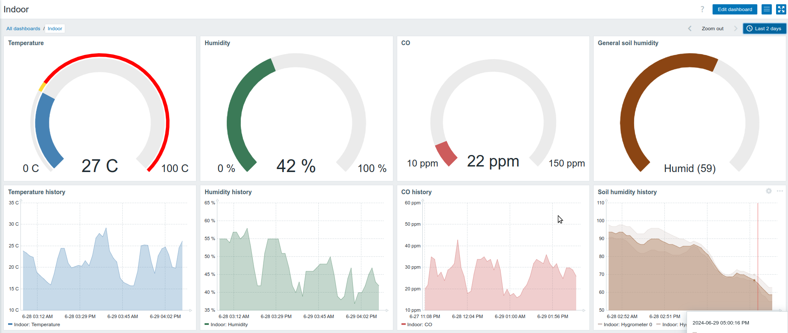

# Indoor Crop Monitoring System



## Description

This system is designed to monitor the environmental conditions of indoor crops using sensors connected to an ESP8266. The data is sent to a Zabbix server, where it is visualized on a control dashboard.

## Sensors Used

- **DHT22**: Temperature and humidity sensor.
- **Hygrometer**: Soil moisture sensor.
  - **Hygrometer 0**
  - **Hygrometer 1**
- **CO Sensor**: Carbon monoxide (CO) sensor.

## Hardware

- **ESP8266**: WiFi microcontroller used to connect and control the sensors.
- **Relay Module**: Used to control additional devices, such as irrigation systems.
- **Logic Level Converter**: To ensure voltage compatibility between the ESP8266 and the sensors.

## Installation and Configuration

1. **Hardware Connection**:
   - Connect the DHT22 to pin D1 of the ESP8266.
   - Connect the hygrometers to pins S0, S1, S2, and S3 of the ESP8266.
   - Connect the CO sensor to pins S0, S1, S2, and S3 of the ESP8266.
   - Connect the relay to pin D2 of the ESP8266.

2. **Software Configuration**:
   - Clone this repository.
   - Configure the WiFi credentials in the `main.cpp` file.
   - Configure the Zabbix server details:
     ```cpp
     const char* WIFI_SSID = "your_wifi_ssid";
     const char* WIFI_PASSWORD = "your_wifi_password";
     String ZABBIX_URL = "http://your_zabbix_url/api_jsonrpc.php";
     String ZABBIX_TOKEN = "your_zabbix_token";
     String HOST_ID = "your_host_id";
     ```
   - Compile and upload the code to the ESP8266 using the Arduino IDE or PlatformIO.

3. **Zabbix Visualization**:
   - Log in to the Zabbix dashboard and configure the widgets to visualize the sensor data.
   - The temperature, humidity, soil moisture, and CO data will be displayed in real-time.

## Usage

The system will collect data from the sensors and periodically send it to the Zabbix server. You can monitor the indoor crop conditions and receive alerts if the sensor values exceed the defined thresholds.

## Hardware Diagram

Below is the hardware connection diagram for setting up the system:


## Dashboard Image


This image shows an example of how the sensor data is visualized on the Zabbix dashboard.

## Contributions

Contributions are welcome. Please fork the repository and submit a pull request with your improvements.

## License

This project is licensed under the MIT License - see the [LICENSE](LICENSE.md) file for details.